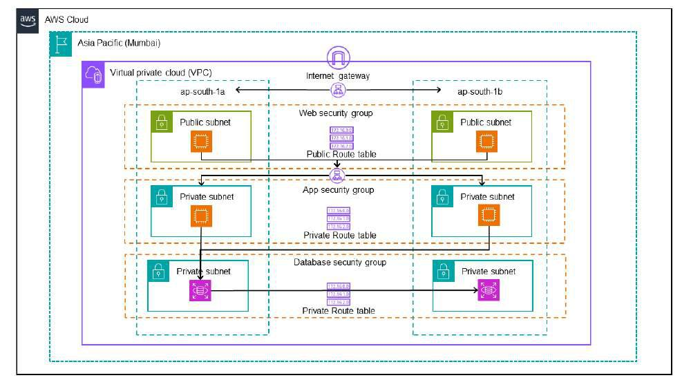
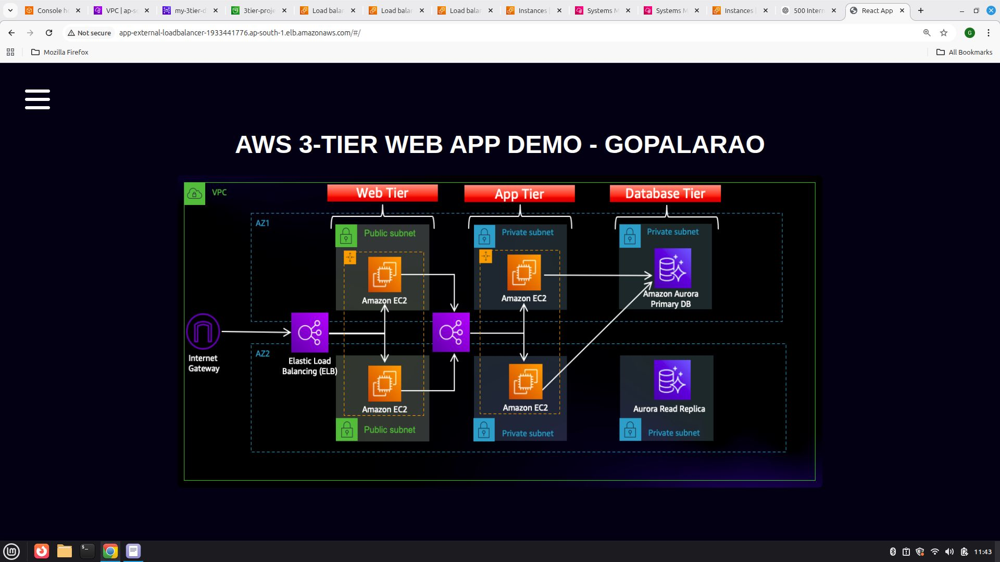
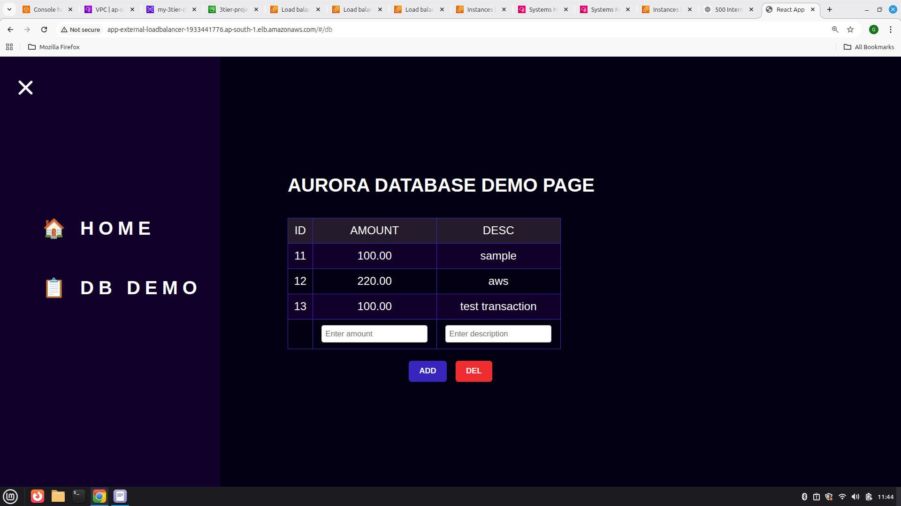
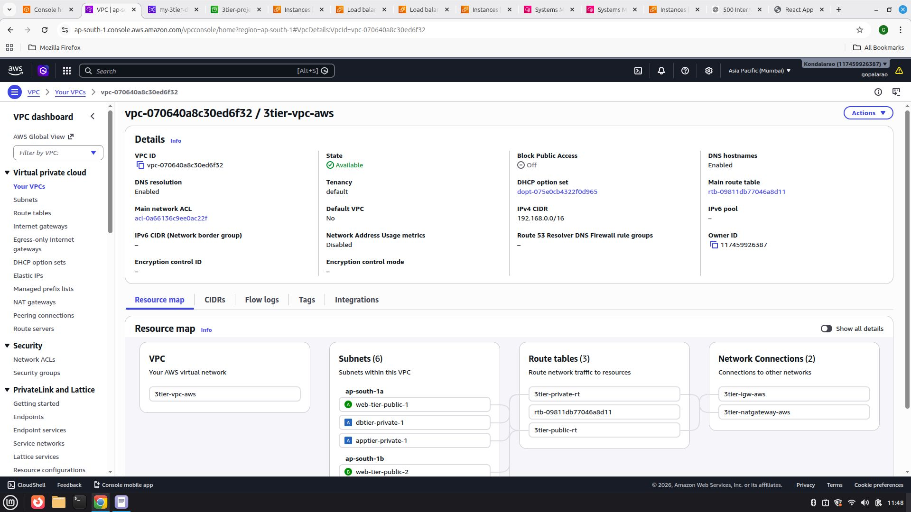
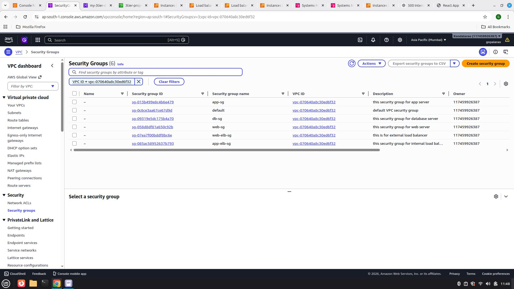
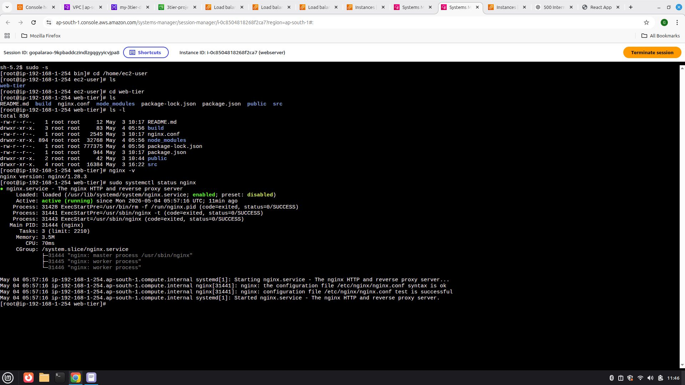
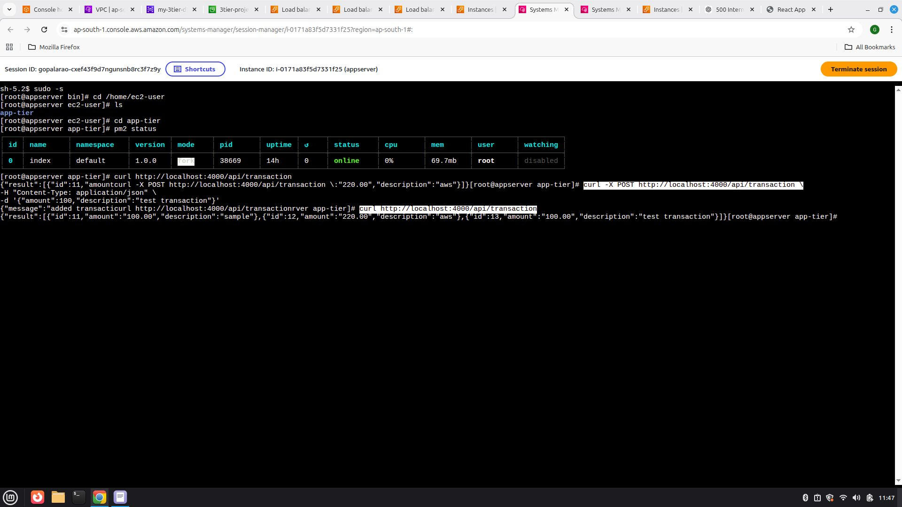
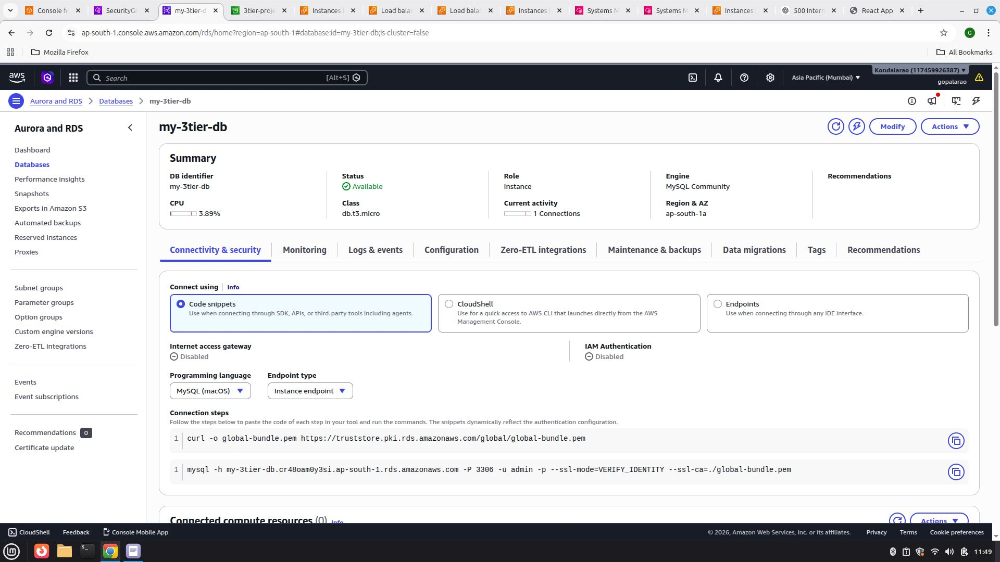
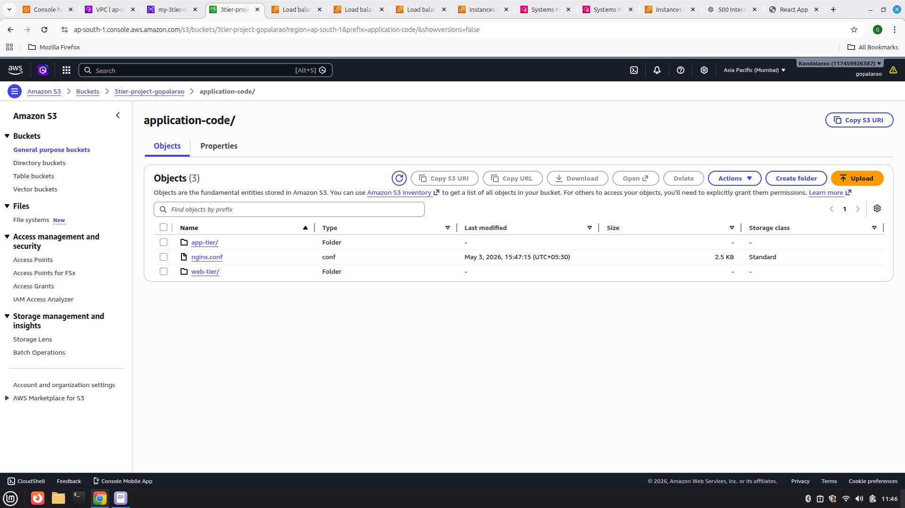
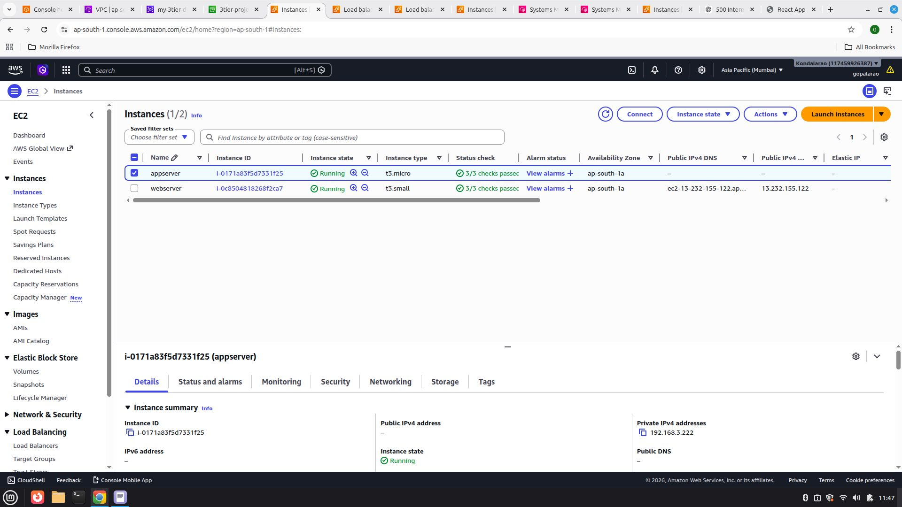

# Production-Ready AWS 3-Tier Web Application Architecture

## Project Overview

This project demonstrates the design and deployment of a highly available, scalable, and secure 3-Tier Web Application Architecture on Amazon Web Services (AWS).

The infrastructure follows industry-standard cloud architecture principles by separating the environment into Web, Application, and Database tiers. The architecture is deployed across multiple Availability Zones to ensure fault tolerance, high availability, and improved reliability.

The application code is stored in Amazon S3 and deployed to application servers hosted within private network segments. Multiple load balancers, auto scaling groups, IAM roles, and secure networking components are implemented to simulate a production-grade AWS environment.

---

## Architecture Highlights

### High Availability Design

* Multi-AZ deployment across two Availability Zones.
* Redundant infrastructure components.
* Load-balanced application traffic.
* Auto Scaling enabled for web and application servers.

### Security-First Approach

* Public-facing resources isolated from backend services.
* Internal Application Load Balancer protects application servers.
* Database layer deployed within private subnets.
* IAM roles used for secure AWS resource access.
* Security Groups enforce controlled communication between tiers.

### Scalability

* Auto Scaling Group for Web Tier.
* Auto Scaling Group for Application Tier.
* Elastic Load Balancing for traffic distribution.

---

## AWS Services Used

### Networking

* Amazon VPC
* Public Subnets
* Private Subnets
* Internet Gateway
* Route Tables
* Security Groups
  
### Compute

* Amazon EC2
* Auto Scaling Groups

### Storage

* Amazon S3

### Load Balancing

* External Application Load Balancer
* Internal Application Load Balancer

### Database

* Amazon RDS

### Identity and Access Management

* IAM Roles

---

## Architecture Components

### 1. Virtual Private Cloud (VPC)

A custom VPC was created to provide network isolation and secure communication between all application components.

Features:

* CIDR Block Configuration
* Public and Private Subnets
* Multi-AZ Architecture
* Secure Routing Configuration

---

### 2. Web Tier

The Web Tier serves as the entry point for users accessing the application.

Components:

* External Application Load Balancer
* Web Server EC2 Instances
* Auto Scaling Group

Responsibilities:

* Accept user requests from the internet.
* Distribute traffic across healthy web servers.
* Improve availability and fault tolerance.
  

---

### 3. Application Tier

The Application Tier contains the business logic of the application.

Components:

* Internal Application Load Balancer
* Application Server EC2 Instances
* Auto Scaling Group

Responsibilities:

* Process requests received from the Web Tier.
* Execute application business logic.
* Communicate securely with the database layer.

Benefits:

* Additional security through network isolation.
* Internal traffic remains private.
* Improved scalability and maintainability.

---

### 4. Database Tier

The Database Tier provides persistent data storage.

Components:

* Amazon RDS
* Private Subnets

Responsibilities:

* Store application data securely.
* Handle database operations.
* Provide high availability and reliable storage.
  

---

### 5. Amazon S3

Amazon S3 is used to store application code and deployment artifacts.

Benefits:

* Centralized application storage.
* High durability.
* Easy integration with AWS services.
  

---

### 6. Bastion Host

A Bastion Host is deployed within the public subnet to securely manage private EC2 instances.

Benefits:

* Secure administrative access.
* Reduced attack surface.
* Controlled SSH connectivity.
  

---

### 7. IAM Roles

IAM Roles are attached to EC2 instances to securely access AWS resources without storing credentials on servers.

Benefits:

* Improved security.
* Least privilege access model.
* Credential management automation.

---

## Request Flow

1. User accesses the application through the External Application Load Balancer.
2. Traffic is routed to healthy Web Tier EC2 instances.
3. Web Tier forwards requests to the Internal Application Load Balancer.
4. Internal Load Balancer distributes requests to Application Tier servers.
5. Application Tier communicates with Amazon RDS.
6. Database returns requested data.
7. Response is returned to the user.

---

## Security Implementation

* Multi-layer Security Groups.
* Private Subnet Isolation.
* Internal Load Balancer Protection.
* Bastion Host Access Control.
* IAM Role-Based Permissions.
* Secure Database Layer.

---

## Learning Outcomes

Through this project, I gained practical experience with:

* AWS VPC Design
* Public and Private Subnets
* Internet Gateway
* Route Tables
* Security Groups
* IAM Roles
* Amazon EC2
* Auto Scaling Groups
* Application Load Balancers
* Amazon RDS
* Amazon S3
* Bastion Host Configuration
* High Availability Design
* Production-Grade AWS Architecture

---

## Project Outcome

Successfully designed and deployed a production-ready 3-tier web application architecture on AWS featuring high availability, scalability, secure network segmentation, load balancing, auto scaling, centralized storage, and managed database services.
